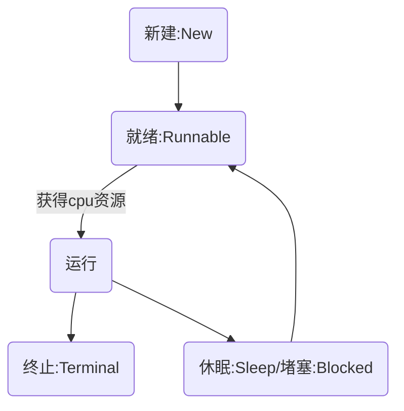
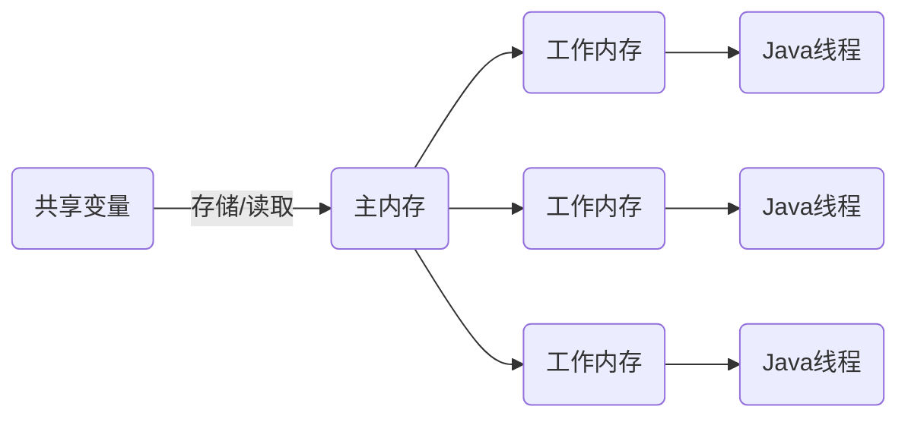
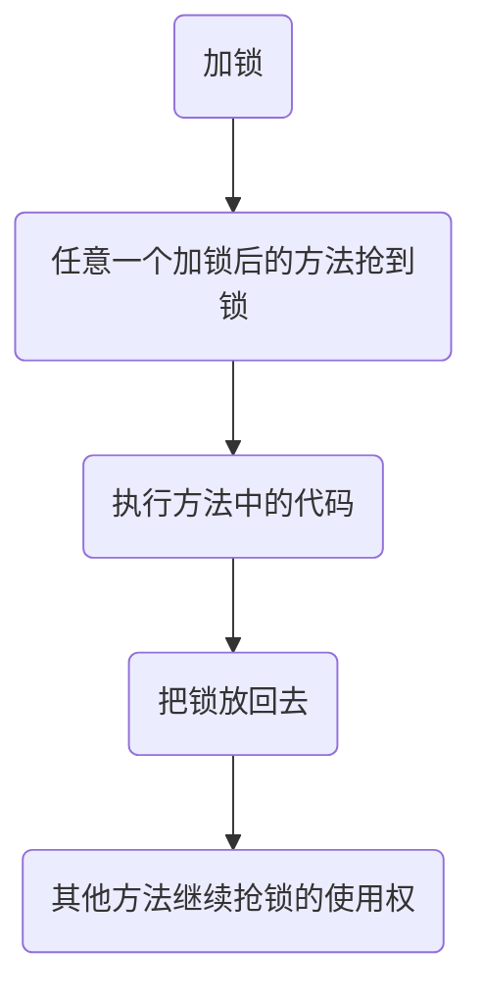
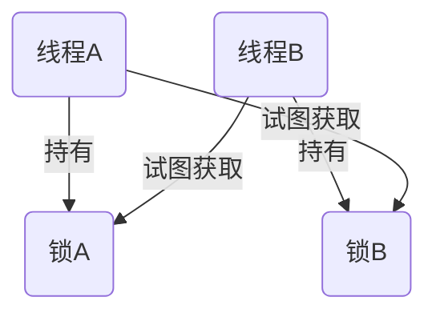
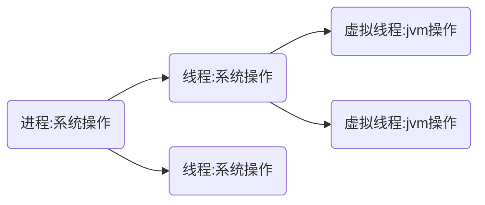

# 线程

进程:程序执行的实体

cpu一个核心在相同时间内只能做一件事情,要实现多个进程要依靠算法实现多个进程同时运行

若希望两个任务同时进行,则需要多开进程,但是每个进程都有自己的内存空间,进程之间通信就变得非常困难,能否在同一个进程中实现多个任务?

线程:一个进程中有多个线程,线程之间共享进程的内存

## 线程状态



## 线程的创立和启动

最简单的创建方式:

```java
Thread thread = new Thread(new Runnable() {
    @Override
    public void run() {
        //具体逻辑
    }
});
```

>main方法是主线程,new出来的Thread是另一个线程,两个互不干扰,但分给时间片的概率不同

- Thread中的方法
  - run:直接将Runnable中的具体逻辑加入主线程中执行
  - start:新开一个线程执行
  - sleep:手动让线程休眠

多线程中的并发问题:

```java
public static void main(String[] args) throws InterruptedException {
    Thread thread1 = new Thread(new Runnable() {
        @Override
        public void run() {
            for (int i = 0; i< 10000;i++) {
                value++;
            }
        }
    });

    Thread thread2 = new Thread(new Runnable() {
        @Override
        public void run() {
            for (int i = 0; i< 10000;i++) {
                value++;
            }
        }
    });
    thread1.start();
    thread2.start();

    System.out.println(value); //输出不为20000
}
```

## 线程休眠和中断

- 如果线程处于运行状态,那么下一状态可能为:
  - cpu消耗完毕,回到可运行状态,等待资源
  - 线程进入堵塞/休眠状态(可手动调用sleep或者wait方法)
  - 线程出现问题/错误

- Thread中的方法
  - interrupt:将中断标识设置为`true`,告诉其他线程这里中断了,**不会**强制停止线程
  - stop:已经废止,使用此方法会强行中断导致资源浪费,可使用interrupt方法+currentThread().isInterrupt()来处理中断后的步骤

使用Thread.interrupt()方法和Thread.currentThread().isInterrupted()方法对线程进行中断操作

```java
Thread thread = new Thread(() -> {
    while(!Thread.currentThread().isInterrupted()) {
        doSomething();
    }
});

Thread.start();

Thread.sleep(10000); //模拟工作时间

Thread.interrupt(); // 停止线程并且不会造成代码运行到一半中断

Thread.join(); //等待线程中断
```

## 线程的优先级

Java的使用的是抢占cpu资源的方式分配资源给每个线程,因此就可以设置每个线程的优先级来分配资源

可使用`setPriority()`设置线程优先级

## 线程礼让和加入

若当前任务不重要则可以使用方法把cpu资源让出去

使用`yield()`让出cpu资源

若在某个线程中想让另外一个线程先执行完成再继续执行,可使用方法让另一个线程加入执行

使用`join()`加入当前线程

## 线程锁和线程同步

线程之间的共享变量存储在主内存中,每个线程都有自己的工作内存,当多个线程对同一个变量进行操作时就会出现**缓存不一致**问题



此时可以加锁解决问题

### synchronized关键词

类锁/对象锁,需要以一个相同的类为参数

效果:多个操作只能一段时间执行一个操作,类似于抢锁的问题,没抢到锁就在synchronized位置等待

流程图:



>synchronized为悲观锁,随时都可以认为有其他线程在对数据进行修改

synchronized关键词也可以加在方法上

若方法为static,则锁的参数为class,方法为非static,则锁的参数为当前对象

#### 死锁

两个线程互相持有对方的锁谁也不让谁,程序卡死称为死锁



检测死锁方式:

```shell
mac@Mel0ny-Macbook-Air ~ % jps //检测当前java进程
92736 Main
5864 Jps
5834 Launcher
mac@Mel0ny-Macbook-Air ~ % jstack 5864 //查看进程栈信息··
```

### wait方法和notify方法

- wait方法:
  - 使线程进入等待状态并且释放当前锁
- notify方法:
  - 唤醒线程,若notify操作和等待线程处于同一把锁,则需要等当前锁释放才能唤醒
  - 当有多个线程用同一把锁时使用notity只能随机唤醒
  - 使用notityAll唤醒所有

例:

```java
Object o = new Object();
Thread t1 = new Thread(() -> {
    synchronized (o) {
        try {
            o.wait();
        } catch (InterruptedException e) {
            throw new RuntimeException(e);
        }
        System.out.print("线程-0已经唤醒");
    }
});
Thread t2 = new Thread(() -> {
    synchronized (o) {
        System.out.print("线程-1已经启动");
        o.notify();
        System.out.print("线程-1后续步骤");
    }
});
t1.start();
t2.start();
```

输出:

```shell
线程-1已经启动
线程-1后续步骤
线程-0已经唤醒
```

## ThreadLocal

每个线程都有自己的工作内存,使用ThreadLocal<>可创建一个只能在线程内使用的变量,每个线程变量被隔开了

设置一个只在特定线程中起作用的变量:

```java
ThreadLocal<String> str = new ThreadLocal<>();

Thread t = new Thread(() -> {
    str.set("Hello");
    System.out.println("线程内部变量：" + str.get());
});

t.start();
System.out.println("线程外部变量：" + str.get());
```

输出:

```shell
线程外部变量：null
线程内部变量：Hello
```

## 定时器

需要定时执行某项任务,可以使用Java已经封装好的类:Timer

```java
Timer timer = new Timer();
timer.schedule(new TimerTask() {
    @Override
    public void run() {
        System.out.println();
    }
},1000); //延迟一秒执行
```

当计划任务结束的时候程序并没有结束,需要使用`cancel`方法取消

## 守护线程

Java程序需要所有子线程都终止了程序才会结束

守护线程:当主线程终止之后自动终止的线程

需要设置当前线程为守护线程只需要使用方法`setDaemon(true)`即可

>IO线程禁止使用守护线程

## 关于多线程下的集合备注

大多数集合都是线程不安全的,若需要保证线程安全则需要使用`java.util.concurrent`下的包

## 并行流

jdk提供了多个并行方法和并行流来使用多线程进行操作

方法和流的关键词:`parallel`

## 线程生成器

jdk21新出了给Thread出了一个builder方法:`ofPlatform()`可以一键配置线程信息

jdk运行程序调用方法是使用栈(Stack)来维护的

例如:

```java
public static void main(String args[]) {
    test1();
}

void test1(){
    test2();
}

void test2() {
    System.out.printf("1");
}
```

在此模型中`main`方法先入栈,然后是`test1`,然后是`test2`

`test2`先出栈,然后是`test1`,最后是`main`

无限地插入栈会OOM

使用`ofPlatform`中的`stackSize`方法设置栈深度

## 虚拟线程

虚拟线程是jdk21的一个轻量级线程,免去了cpu调度上下文的开销,消耗资源更小,并发能力更高



- 虚拟线程特性
  - 默认是守护线程,不能修改,需要使用`join`方法加入主线程中
  - 使用`ofVirtual()`builder构建或使用`startVirtualThread()`开启虚拟线程
  - 用法与普通线程几乎一致
