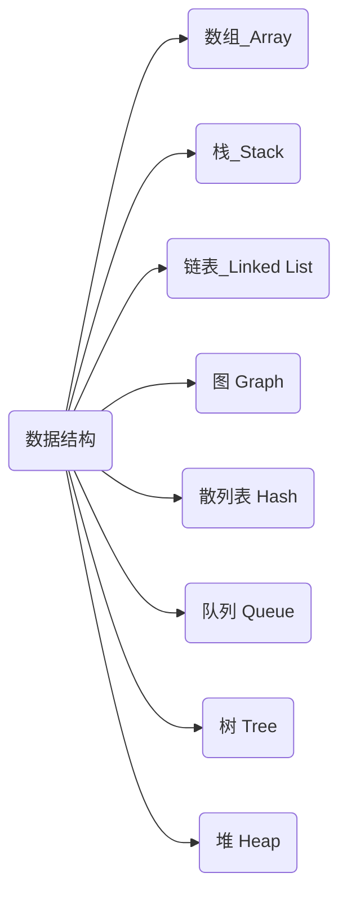

# 数据结构



## 线性表

存放数据依然使用**数组**,但是可以对其进行增强

### 顺序表(ArrayList)


底层依然采用**顺序存储**实现的线性表称为**顺序表**

```java
Object[] data = new Object[capacity]
```

顺序表结构紧凑,插入删除元素其他元素要挪位,插入范围为[0,size]

|属性|值|
|:---:|:---:|
|底层存放结构|数组|
|默认大小|10|
|默认扩容大小|1.5倍|

### 链表(LinkedList)


不需要像顺序表开辟一处连续完整的内存空间，每个节点通过指针相连

每个节点存放一个元素以及指向下一个节点的指针

```java
private class Node<E> {
        E element;
        Node<E> next;
        Node<E> prev;

        Node(Node<E> prev, E element, Node<E> next) {
            this.element = element;
            this.next = next;
            this.prev = prev;
        }
    }
```

|属性|值|
|:---:|:---:|
|底层存放结构|节点|
|默认大小|无|
|节点|包含一个元素以及指针|

|操作|顺序表|链表|
|:---:|:--:|:---:|
|读|按照数组索引获取|遍历节点|
|写|需要移动整体数字|移动指针|

### 栈(Stack)


只能在表尾删除插入元素,遵循先进后出,一般竖着看

### 队列(Queue)


只能在队列头出,遵循先进先出,一般横着看

## 树


一个节点向下不断延伸,像树一样,每一个节点有可能是一个分支点,延伸后不能与其他节点相交

最上方的节点称为**根节点**

节点连接的子节点的数目称为**度**

每个节点延伸下去的节点称为**子树**

每个节点从上往下的顺序称为**层次**

每棵树最大的层次称为**深度**

每棵树都有**子节点**和**父节点**,有相同父节点的节点称为**兄弟节点**

最下层的节点称为**叶子节点**

从一个节点到另一个节点所经过的节点都成为该节点的**祖先节点**

### 二叉树

二叉树的度始终为2并且有左右之分(从左到右顺序排列)

整棵树很饱满:满二叉树

#### 查询方式

- 前序遍历

走到哪遍历输出到哪

如图顺序:50 -> 30 -> 20 -> 40 -> 70 -> 60 -> 80

```java
public String forEach(TreeNode<String> tree) {
    if(tree == null) break;

    System.out.printf(tree.element);
    forEach(tree.left);
    forEach(tree.right);
}
```

- 中序遍历

先遍历左子树,打印完再遍历右子树打印,调整输出顺序

如图顺序:20 -> 30 -> 50 -> 70 -> 60 -> 80

```java
public String forEach(TreeNode<String> tree) {
    if(tree == null) break;

    forEach(tree.left);
    System.out.printf(tree.element);
    forEach(tree.right);
}
```

- 后序遍历

先遍历子元素再遍历父元素

如图顺序:20 -> 40 -> 30 -> 70 -> 60 -> 80 -> 50

```java
public String forEach(TreeNode<String> tree) {
    if(tree == null) break;

    forEach(tree.left);
    forEach(tree.right);
    System.out.printf(tree.element);
}
```

- 层序遍历

一层一层遍历

如图顺序:50 -> 30 -> 70 -> 20 -> 40 -> 60 -> 80

```java
public String forEach(TreeNode<String> tree) {
    LinkedQueue<String> quene = new LinkedQueue<>();
    queue.offer(root);
    while(!queue.isEmpty) {
        TreeNode<String> node = queue.roll;
        System.out.printf(node.element + " ");
        if(node.left != null) queue.offer(node.left);
        if(node.right != null) queue.offer(node.right);

    }
}
```

#### 二分二叉树

- 规则
  - 最大数放根节点
  - 节点的左边放比节点元素小的元素,右边放比节点元素大的元素

但数据过于整齐时,二分二叉树退化成链表,查询速率变为$O(n)$

#### 平衡二叉树

- 规则
  - 平衡二叉树一定是二分查找树
  - 从根节点开始,左右子树的高度差不大于一
  - 平衡因子:左子树高度减去右子树高度,用于计算平衡树是否平衡

#### 红黑树

- 规则
  - 节点可以是红色或黑色
  - 根节点必须是黑色
  - 红色的父节点和子节点不能是红色
  - 所有的空节点必须是黑色
  - 所有的节点到空节点所经过的黑色节点数量相同

## 哈希表

散列通过散列函数将要检索的数据与哈希值联系起来,生成一种便于搜索的数据结构

例:最简单的哈希函数取模,输入哈希值取模获取下标再插入,查询时再次计算哈希值获取位置

>注:保存的数据是无序的

若计算出来的哈希值相同,则称为**哈希碰撞**

若计算出来的哈希值相同可在相同位置使用链表或其他数据结构进行存放
