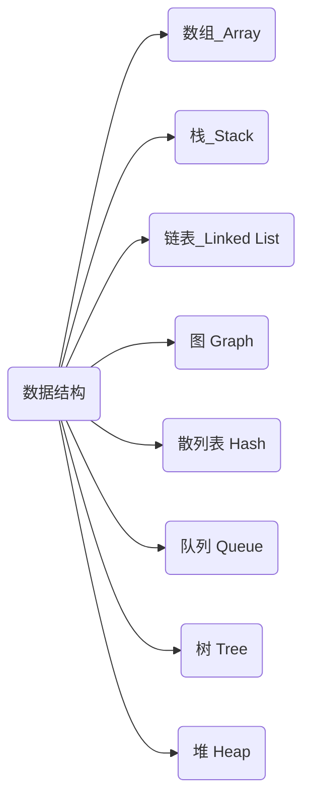
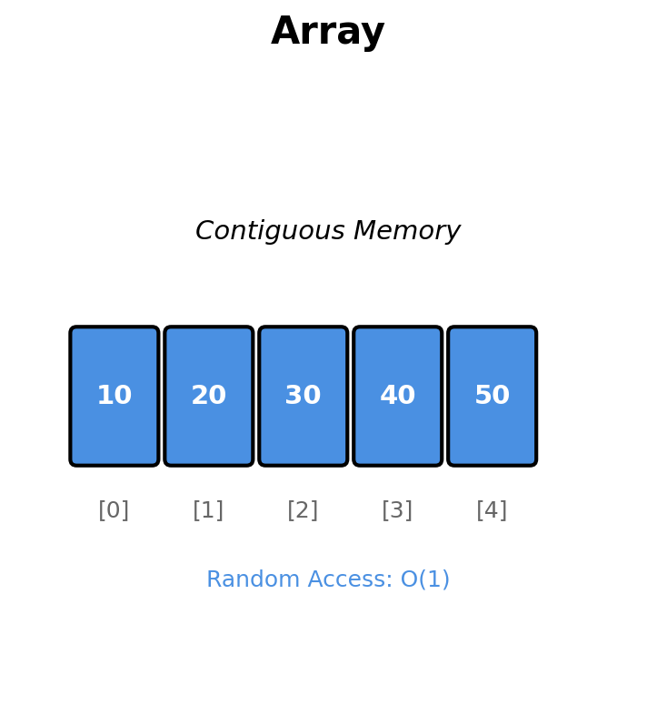
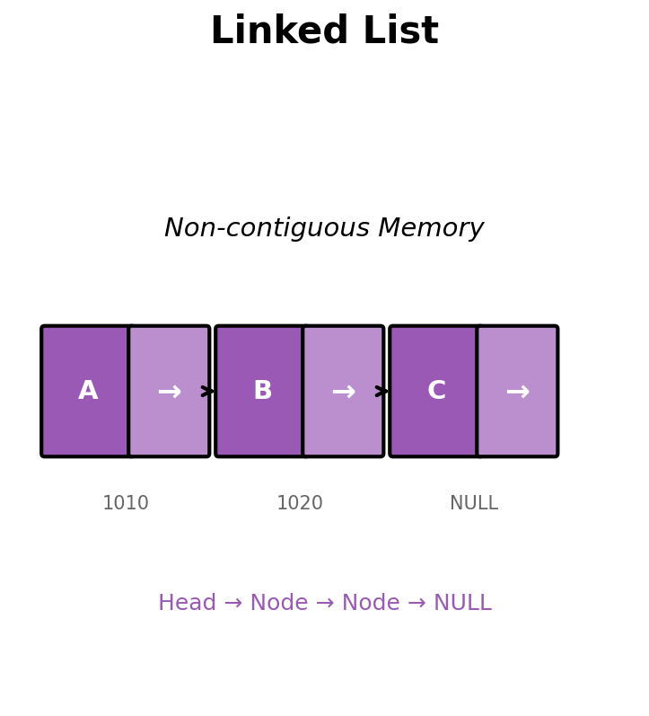
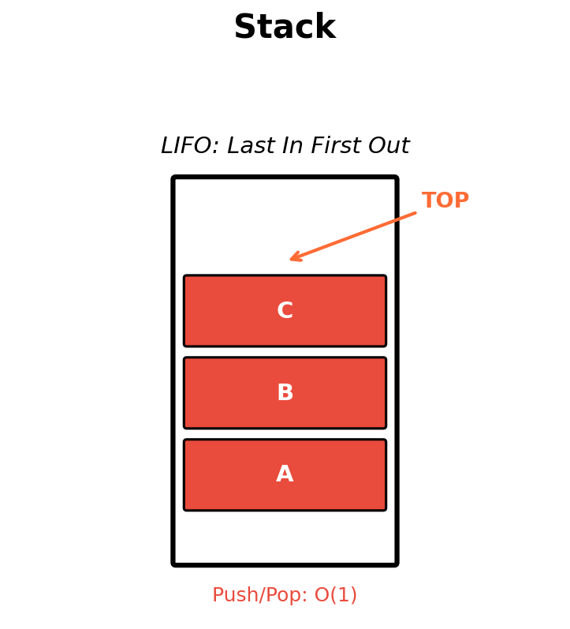
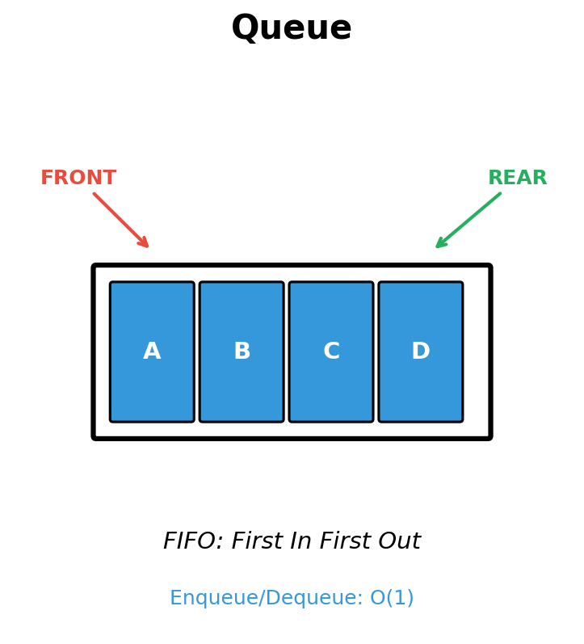
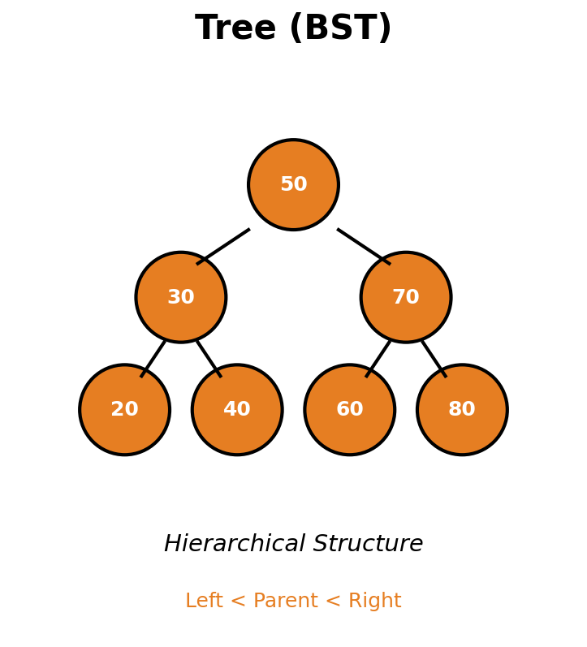

# 数据结构

## 线性表

存放数据依然使用**数组**,但是可以对其进行增强

### 顺序表(ArrayList)

底层依然采用**顺序存储**实现的线性表称为**顺序表**

顺序表结构紧凑,插入删除元素其他元素要挪位,插入范围为[0,size]

|属性|值|
|:---:|:---:|
|底层存放结构|数组|
|默认大小|10|
|默认扩容大小|1.5倍|

### 链表(LinkedList)

不需要像顺序表开辟一处连续完整的内存空间，每个节点通过指针相连

每个节点存放一个元素以及指向下一个节点的指针

|属性|值|
|:---:|:---:|
|底层存放结构|节点|
|默认大小|无|
|节点|包含一个元素以及指针|

|操作|顺序表|链表|
|:---:|:--:|:---:|
|读|按照数组索引获取|遍历节点|
|写|需要移动整体数字|移动指针|

### 栈(Stack)

只能在表尾删除插入元素,遵循先进后出,一般竖着看

### 队列(Queue)

只能在队列头出,遵循先进先出,一般横着看

## 树

一个节点向下不断延伸,像树一样,每一个节点有可能是一个分支点,延伸后不能与其他节点相交

最上方的节点称为**根节点**

节点连接的子节点的数目称为**度**

每个节点延伸下去的节点称为**子树**

每个节点从上往下的顺序称为**层次**

每棵树最大的层次称为**深度**

每棵树都有**子节点**和**父节点**,有相同父节点的节点称为**兄弟节点**

最下层的节点称为**叶子节点**

从一个节点到另一个节点所经过的节点都成为该节点的**祖先节点**

### 二叉树

二叉树的度始终为2并且有左右之分(从左到右顺序排列)

整棵树很饱满:满二叉树
