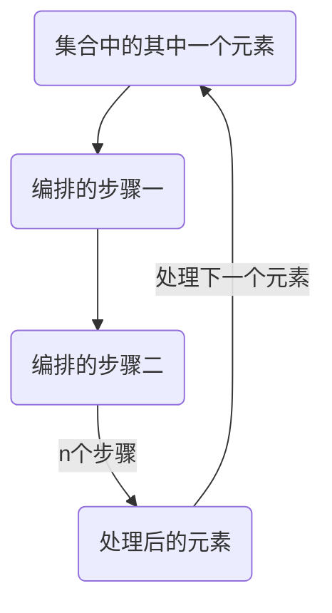

# Stream

使处理数据就想工厂流水线一样

- 与原先写法区别
  - 传统:一批一批处理数据,做完了一个步骤之后才到另外一个步骤
  - Stream:一个一个元素像流水线一样,先编排好流程,一个一个元素处理,省去很多内存开销

- 步骤
  - 编排流水线(filter,map...)
  - 启动生产线(collect,forEach...)



>到后期还能使用Stream开N条流水线

## 编排方法

### map

将集合中的元素映射成另外一种形式

参数:`Function<? super T, ? extends R> mapper`

例:

```java
//将元素x映射成元素x的长度
list.map(x -> x.length()).forEach(System.out::printf);
//在String元素后进行一些操作
list.map(x -> x + "后续操作").forEach(System.out::printf);
```

### filter

过滤流水线上的元素

参数:`Predicate<? super T> predicate` (为true/false的表达式)

### distinct

去重

### limit

限制个数

参数:`long maxSize`

### skip

跳过个数

参数:`long n`

### sorted

排序(需要类实现了Comparable接口)

参数:空(默认排序)或`Comparator<? super T> comparator`

## 收集方法

### collect

收集,开动流水线,规定怎样输出

参数:`Collector<? super T, A, R> collector`

其中的Collector类封装了很多收集方法

#### Collectors

- 方法
  - `groupingBy(Function<? super T, ? extends K> classifier)`:根据什么内容分组,例如`groupingBy(str - > str.length)`:根据长度分组,长度相同的分在一起
  - `joining()/joining(CharSequence delimiter,CharSequence prefix,CharSequence suffix)`:将集合连接在一起/在集合中添加分隔符(delimiter),前缀(prefix),后缀(suffix)
  
### toList

收集,开动流水线,将处理好的元素变为List集合

## 数字流

IntStream,DoubleStream,FloatStream...

均为基本数据的流,可对数据进行操作

## 统计流

IntSummaryStatistics,DoubleSummaryStatistics...

用于统计流水线上的元素数据
